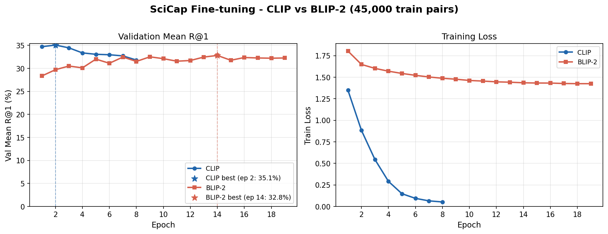
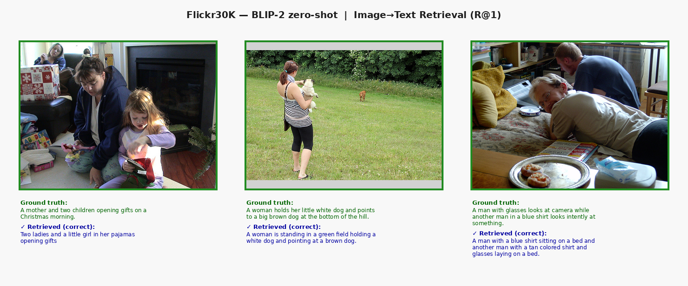
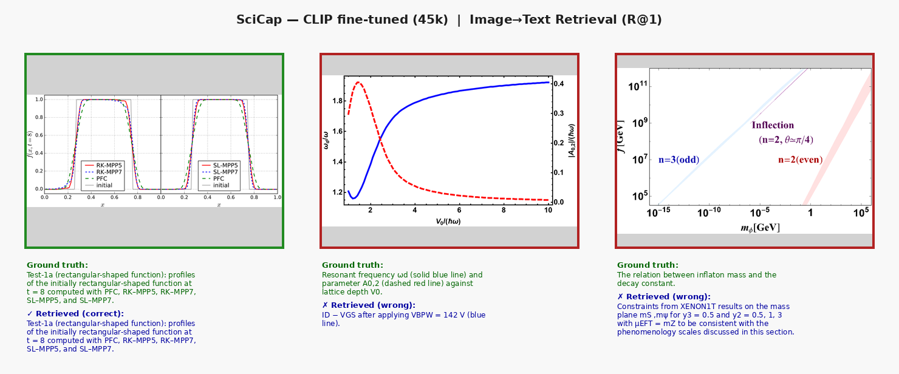

# Comparative Analysis of CLIP vs BLIP-2 for Image-Text Retrieval

Bachelor thesis project by **Tibor Horcsin** at the Technical University of Kosice, Faculty of Electrical Engineering and Informatics.

This project compares **CLIP ViT-L/14** and **BLIP-2 Salesforce/blip2-itm-vit-g** for image-text retrieval. It studies retrieval accuracy, runtime cost, and transfer from Flickr30K natural photographs to SciCap scientific figure-caption data.

[View the GitHub repository](https://github.com/thorrin5/clip-vs-blip2-image-text-retrieval)

## Key Results

| Dataset | Model | Setting | Mean R@1 | Mean R@5 | Mean R@10 | Runtime (s) |
|---|---:|---:|---:|---:|---:|---:|
| Flickr30K | CLIP | zero-shot | 75.06 | 92.34 | 95.56 | 5 |
| Flickr30K | BLIP-2 | zero-shot | 91.55 | 98.37 | 99.19 | 4247 |
| SciCap | CLIP | zero-shot | 21.65 | 33.95 | 40.25 | 13 |
| SciCap | BLIP-2 | zero-shot | 26.30 | 35.55 | 39.95 | 1988 |
| SciCap | CLIP | fine-tuned | 33.95 | 50.55 | 58.10 | 10 |
| SciCap | BLIP-2 | fine-tuned | 30.00 | 42.20 | 47.75 | 5195 |

## Training Curves

## Qualitative Examples

Datasets and model checkpoints are not included. The repository is intended for academic reproducibility and transparent inspection of the thesis experiment code and results.

